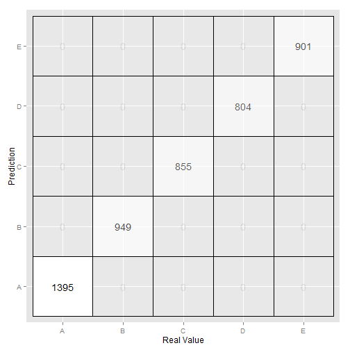

# Sypnosis #

The goal of this project is to use data from accelerometers on different parts of the bosy of 6 participants to predict how well they are doing a physical activity. 

The partipants were asked to perform barbell lifts correctly and incorrectly in 5 different ways. Therefore, the data set consists of data from six different participants and the outcome is classified into five different categories, one category corresponds to doing the exercise correctly and four correspond to common mistakes. The main objective is to implement a classifier that correctly categorizes 20 samples provided as a testing set.

# Data processing #

The first step was loading the data

```r
ml   <- read.csv("pml-training.csv", header = T)
```

Once the data was loaded, I inspected it to understand its quality and identify possible improvements. There were several variables with mainly NA or no values. These variables were removed with the help of excel. Furthermore, since in the testing set there are only variables new_window equal to 'no', all 'yes' rows were deleted.
You can also embed plots, for example:


```r
ml   <- read.csv("pml-training.csv", header = T)
ml2<-ml[ml$new_window=='no',]
```


# Model building #

The first step was to divide the training set into ttraining and testing set. The training is large enough to achieve a  high accuracy, and the cross validation set is also large enough to give a good indication of the out of sample error.

The training data set was split up into one portion (75%) for model building (14718 observations) and another portion (25%) for cross-validation (4904 observations). The cross validation technique used was random sampling.

Random forest has been the prediction algorithm used. 


```r
inTrain<- createDataPartition(y=ml2$classe, p=0.75, list=FALSE) 
training<-ml2[inTrain,] 
testing<-ml2[-inTrain,]
rf<- randomForest(formula = classe ~ ., data = training) 
```

```
## Error: missing values in object
```

```r
rf
```


As we can see the ex[ected sample error rate is 0.01%


# Model testing #

Once I had built the random forest, I needed to test it on the previously created testing set. As we can see the random forest had a high accuracy.
As we can see in the confussion matrix, we expect an accuracy of 100% with CI (99.92%- 100%). Therefore the estimated error with cross validation is 0 with confidence intervals of 0-0.08%


```r
pred<- predict(rf,testing)
confusionMatrix(pred,testing$classe)
```

```
## Confusion Matrix and Statistics
## 
##           Reference
## Prediction    A    B    C    D    E
##          A 1367    0    0    0    0
##          B    0  929    0    0    0
##          C    0    0  838    0    0
##          D    0    0    0  786    0
##          E    0    0    0    0  882
## 
## Overall Statistics
##                                     
##                Accuracy : 1         
##                  95% CI : (0.999, 1)
##     No Information Rate : 0.285     
##     P-Value [Acc > NIR] : <2e-16    
##                                     
##                   Kappa : 1         
##  Mcnemar's Test P-Value : NA        
## 
## Statistics by Class:
## 
##                      Class: A Class: B Class: C Class: D Class: E
## Sensitivity             1.000    1.000    1.000    1.000    1.000
## Specificity             1.000    1.000    1.000    1.000    1.000
## Pos Pred Value          1.000    1.000    1.000    1.000    1.000
## Neg Pred Value          1.000    1.000    1.000    1.000    1.000
## Prevalence              0.285    0.193    0.175    0.164    0.184
## Detection Rate          0.285    0.193    0.175    0.164    0.184
## Detection Prevalence    0.285    0.193    0.175    0.164    0.184
## Balanced Accuracy       1.000    1.000    1.000    1.000    1.000
```

In the following plot I show the results on the testing set. As we can see, all observations in the testing set are predicted accurately.

```r
matrix.table <- as.data.frame(confusionMatrix$table)
ggplot(matrix.table, aes(x=Reference, y=Prediction,alpha = Freq)) +
  geom_tile(fill="white", color="black") +
  geom_text(aes(label=matrix.table$Freq)) +
  theme(legend.position="none" )+
  xlab("Real Value") +  ylab("Prediction") 
```

 


# Final comments #

The model used was a random forest algorithm using 500 trees. Accuracy obtained was 99.9%. The random forest algorithm correctly identified 20 out of 20 test cases (100% accurate): B A B A A E D B A A B C B A E E A B B B

